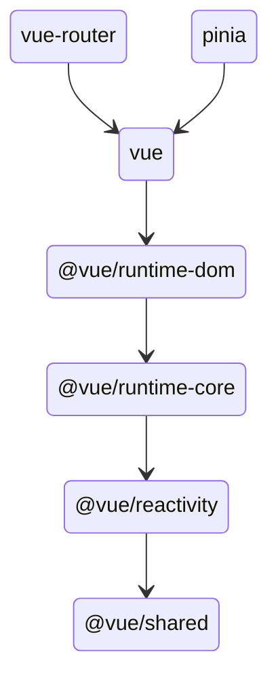
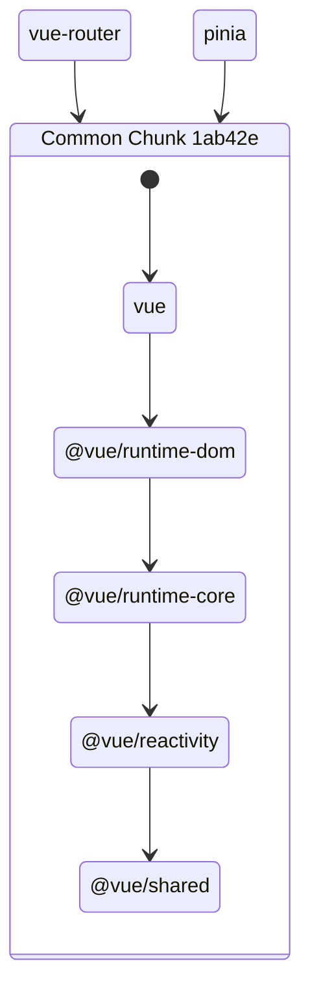
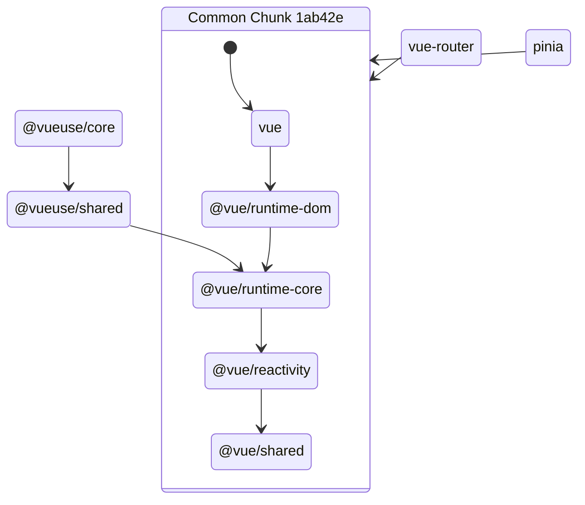
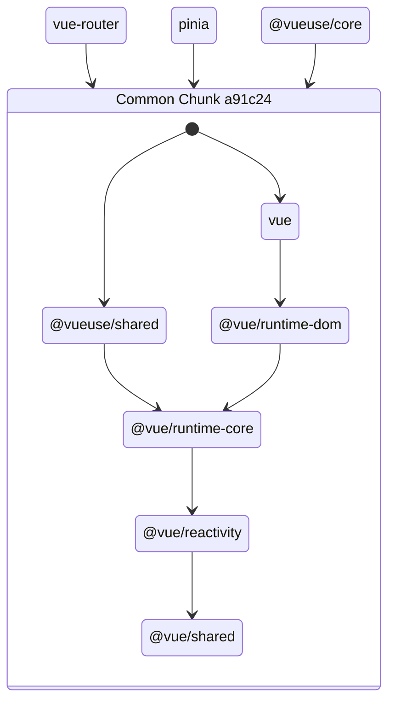

# Nuxt Better Optimize Deps

[![npm version][npm-version-src]][npm-version-href]
[![npm downloads][npm-downloads-src]][npm-downloads-href]
[![License][license-src]][license-href]
[![Nuxt][nuxt-src]][nuxt-href]

Provide better default `vite.optimizeDeps` configuration for Nuxt.

Context:

- https://github.com/nuxt/nuxt/issues/26783
- https://github.com/nuxt/nuxt/issues/24196

## Quick Setup

Install the module to your Nuxt application with one command:

```bash
npx nuxi module add nuxt-better-optimize-deps
```

## How it works?

[Vite's deps optimize feature](https://vitejs.dev/guide/dep-pre-bundling.html) use `esbuild` to bundle all discovered dependencies into multiple chunks, where common dependencies will be bundled into a shared chunk. For example, the dependency tree of `vue-router` and `pinia` would looks like this:



After deps optimize, esbuild will detect that vue related packages are common dependencies of `vue-router` and `pinia`, and bundle them into a shared chunk:



This usually works well. But when a new dependency is discovered and it uses things from the shared chunk that was not exposed in the chunk entry, for example, `@vueuse/core` deps in `@vue/runtime-core`, the story becomes:




Which won't work, so the chunks need to be regenerated:



In that case, because the old chunk is already executed in the browser, we have to do a page refresh to get the latest chunk. Theoretically, this happends everytime when you introduce a new dependency that imports `vue`, or any other packages that are already in common chunks. This is one of the reason you might encounter the annoying page reloads consistently.

In this module, we propose a new default to Nuxt's vite optimizeDeps options, that externalized those common deps and make them not participating the pre-bundling (because they are already browser compactible ESM). This should highly reduce the chance for hitting the need to reload the pages.

```diff
{
  vite: {
    optimizeDeps: {
--    include: ['vue', 'vue-router']
++    include: [],
++    exclude: ['vue', '@vue/runtime-dom', 'vue-router' ...]
    }
  }
}
```

Give it a try and share with us how it works to you. Deps on the feedback we might consider changing the defaults in Nuxt directly in the future.

Huge thanks to @patak-dev for the disussions and ideas about this solution.


<!-- Badges -->
[npm-version-src]: https://img.shields.io/npm/v/nuxt-better-optimize-deps/latest.svg?style=flat&colorA=020420&colorB=00DC82
[npm-version-href]: https://npmjs.com/package/nuxt-better-optimize-deps

[npm-downloads-src]: https://img.shields.io/npm/dm/nuxt-better-optimize-deps.svg?style=flat&colorA=020420&colorB=00DC82
[npm-downloads-href]: https://npmjs.com/package/nuxt-better-optimize-deps

[license-src]: https://img.shields.io/npm/l/nuxt-better-optimize-deps.svg?style=flat&colorA=020420&colorB=00DC82
[license-href]: https://npmjs.com/package/nuxt-better-optimize-deps

[nuxt-src]: https://img.shields.io/badge/Nuxt-020420?logo=nuxt.js
[nuxt-href]: https://nuxt.com
